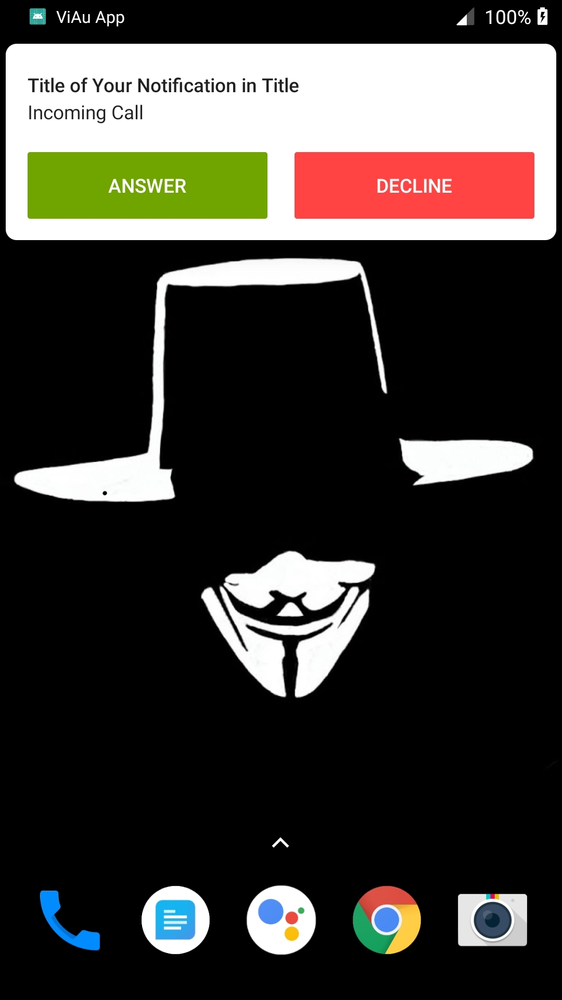
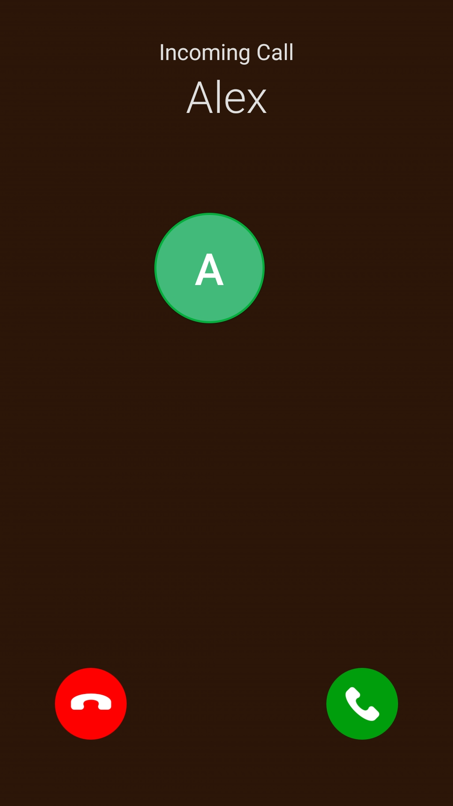

# Android Call Notifications App (React Native)

|                       Banner Notifications                       |                         FullScreen Notifications                         |
| :--------------------------------------------------------------: | :----------------------------------------------------------------------: |
|  |  |

## Prerequisites for project

1. Create a firebase project from firebase console
2. Download `google-services.json` from your project and place in `android>app` directory.
3. Make sure of your app package name. The package name should be unique while creating a project in firebase console.
4. Replace the existing package(com.viauapp) name with your package name in the RNFirebaseCallNotifications project.

## Project setup

1. Clone the repository and go to root directory and do `npm install`
2. And start metro bundler `react-native start --reset-cache`
3. Connect your android device or start emulator and run the following command `react-native run-android`
4. You will find the fcm token in console log. Use that fcm token to test the call notifications

## Following installation steps

- https://rnfirebase.io/docs/v5.x.x/installation/initial-setup

- https://rnfirebase.io/docs/v5.x.x/installation/android

- https://rnfirebase.io/docs/v5.x.x/messaging/android

- https://rnfirebase.io/docs/v5.x.x/notifications/android

## Send notification request example for api

### Path(POST): https://fcm.googleapis.com/fcm/send

    + Headers

            {
                "Content-Type": "application/json",
                "Authorization": "key=AAAA39to........"
            }

    + Content

            {
                "to": "****",
                "data":{
                    "channel_id":"fcm_call_channel",
                    "title": "Incoming call",
                    "body": "Alex is calling",
                    //you can add custom key values here
                },
                "priority": high,
                "topic":all
            }

### Request detail: https://firebase.google.com/docs/cloud-messaging/http-server-ref
